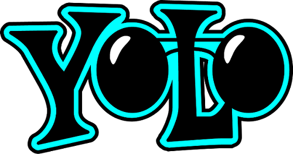
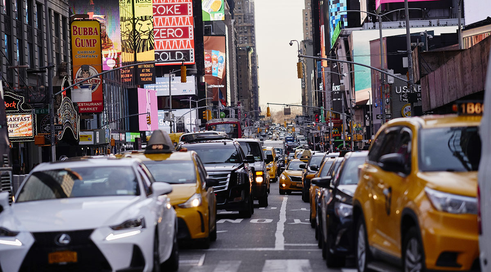
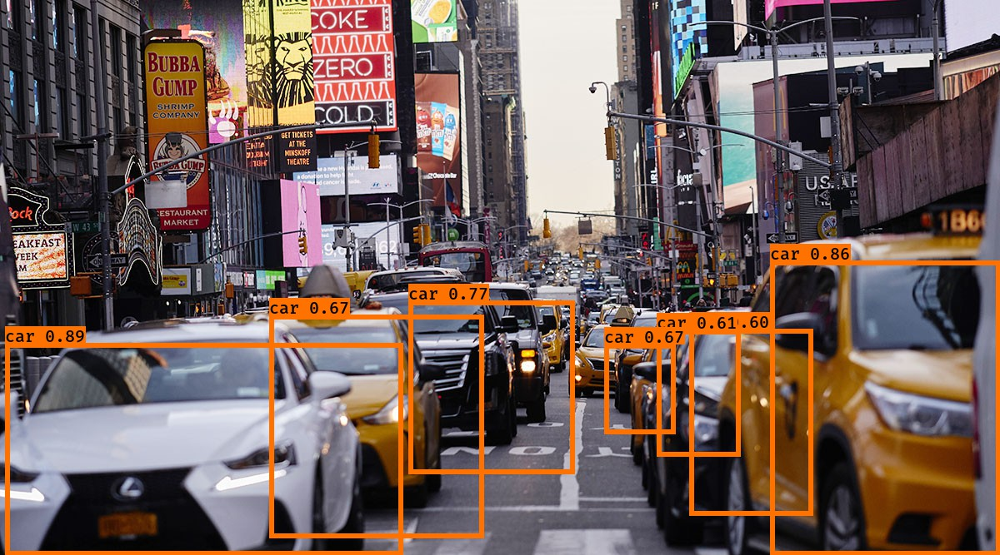

# YOLO

This an implimentation of Object Detection in images through YOLO (You Only Look Once) algorithm.

"You Only Look Once" (YOLO) is a popular algorithm because it achieves high accuracy while also being able to run in real-time. This algorithm "only looks once" at the image in the sense that it requires only one forward propagation pass through the network to make predictions. After non-max suppression, it then outputs recognized objects together with the bounding boxes.

You can read more about YOLO in below link :
https://hackernoon.com/understanding-yolo-f5a74bbc7967

## Implimentation
Here I am using a pretrained model, but you can train the model on your own datasets. Training your own yolo model would require a high end GPU.
To apply it on your own images, clone the repo to your desktop then insert your images on the image folder. Then run the file object_detection_in_images_yolo.ipynb and see the results in the out folder.

You can use Jupyter notebook to run.

## Example

### Input

### Output

